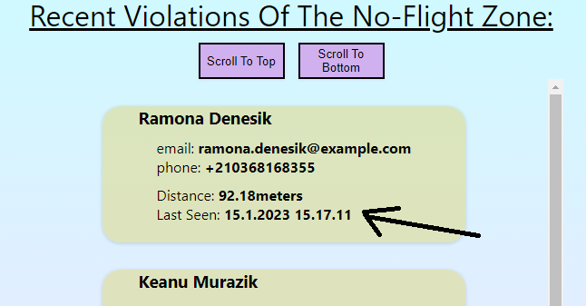

# project-birdnest
Pre-assignment for Reaktor Developer Trainee program

Deployed at render.com: https://project-birdnest.onrender.com/

This application shows all the pilots that come 100meters or closer to Monadikuikka's nest:

The pilots are automatically sorted so that the most recent violation is placed at the top.
The same pilot won't appear in the list twice but rather the "Last seen" property is updated
if the same pilot does another trespassing. Also the distance is updated so that for all the pilots
the closest confirmed distance is displayed. After 10 minutes the pilot data is removed from the list.

The app also contains buttons which makes it easier to scroll up and down the list of pilots.

